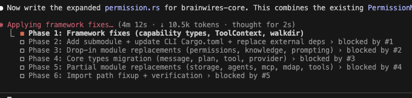

NEEDS TO FUCKING SEARCH THE WEB MORE!



Data Mining Agents

I need ways to have other platforms integrate themselves into the system.

User's own part of the company - exchanged for unused money spent per month.

Claude really has two types of agents "Explore" = Learner, and "Task" = Doer (editor).

Parallel Task Batching - API discounts with Claude.

Bridge agents on multiple computers while compleing a shared task. Each agent can have different capabilities and access to different resources, but they can communicate and collaborate to achieve a common goal. Then grow and expand to larger networks of agents working together on complex problems. This could be used for distributed problem solving, collaborative research, or even creating a network of AI assistants that can share knowledge and resources (especially compute resources). Computer is going to be at a premium in the near future. Those that have compute can sell it to those that don't. This is a way to pool resources together and share them across a network of agents. This could even be used to run a open model on someone else's hardware and pay them for the compute time. This could be a way to democratize access to powerful AI models and make them more accessible to everyone. It could also be a way to create a more decentralized and resilient AI ecosystem, where agents can collaborate and share resources without relying on a single centralized entity.

Methodologies
  - Web search proper operation if unsure
  - Read a file before write logic, seems very important.
  - Use Plans + Tasks for complex multi-step operations

- Rename scape to "WebPageSnapshot" - "webpage_snapshot"

Need a system - maybe related to or is actually MDAP... Trading off more compute for better accuracy and reliability for less refined models.
Running a mini-loop: Solve -> Validate -> Reflect -> Correct -> Solve (or something like this)


Claude uses Plans + Tasks together to breakdown complex requests into manageable steps. Tasks representing each step in a single phase. Tasks are not determined by the plan, but instead generated from the live breakdown of the current phase.

Idea: Objectives + Plan + Tasks

│ Future Enhancements (Post-Integration)                                                                                                                                             │
│                                                                                                                                                                                    │
│ 1. SEAL Reflection → BKS Correction: When reflection detects common errors, create BKS truths about avoiding them                                                                  │
│ 2. Cross-User Pattern Analysis: Aggregate SEAL patterns from multiple users server-side for meta-learning                                                                          │
│ 3. Entity Relationship Graph Integration: Use SEAL's relationship graph for more sophisticated BKS truth matching                                                                  │
│ 4. Adaptive Threshold Tuning: Learn optimal confidence thresholds per user based on accuracy feedback                                                                              │
│ 5. Pattern Conflict Resolution: When SEAL and BKS disagree, use voting or confidence comparison   


Overview                                                                                                                                                                            
                                                                                                                                                                                    
This module provides validation tools for checking duplicates, verifying builds, and checking syntax. While functional for basic use cases, there are several gaps and areas for    
improvement.                                                                                                                                                                        
                                                                                                                                                                                    
Critical Issues                                                                                                                                                                     
                                                                                                                                                                                    
1. Security Vulnerabilities 🔴                                                                                                                                                      
                                                                                                                                                                                    
Location: Lines 107-110, 274-277                                                                                                                                                    
Command::new(command)                                                                                                                                                               
    .args(&args)                                                                                                                                                                    
    .current_dir(working_directory)  // No validation of path                                                                                                                       
- Issue: No input validation on file_path or working_directory                                                                                                                      
- Risk: Path traversal attacks, accessing sensitive directories                                                                                                                     
- Fix: Validate paths, canonicalize, check against allowed directories                                                                                                              
                                                                                                                                                                                    
2. Command Injection Risk 🔴                                                                                                                                                        
                                                                                                                                                                                    
Location: Lines 96-105                                                                                                                                                              
- Issue: While using Command API (which is safe), there's no validation that the working directory or file paths don't contain special characters                                   
- Fix: Add path sanitization and validation                                                                                                                                         
                                                                                                                                                                                    
3. Missing Error Handling 🟡                                                                                                                                                        
                                                                                                                                                                                    
Location: Lines 16, 213                                                                                                                                                             
let content = std::fs::read_to_string(file_path)?;  // No existence check                                                                                                           
- Issue: No explicit check if file exists before reading                                                                                                                            
- Fix: Add explicit file existence and permissions checks                                                                                                                           
                                                                                                                                                                                    
Major Gaps                                                                                                                                                                          
                                                                                                                                                                                    
4. Limited Export Detection 🟡                                                                                                                                                      
                                                                                                                                                                                    
Location: Lines 24-28, 60-92                                                                                                                                                        
if line.contains("export const") || line.contains("export function") ...                                                                                                            
Missing patterns:                                                                                                                                                                   
- export default                                                                                                                                                                    
- export { foo, bar } (named exports)                                                                                                                                               
- export * from './module' (re-exports)                                                                                                                                             
- export enum / export namespace (TypeScript)                                                                                                                                       
- export async function                                                                                                                                                             
- Multi-line exports                                                                                                                                                                
- Exports with decorators                                                                                                                                                           
                                                                                                                                                                                    
Example gap:                                                                                                                                                                        
// This won't be detected:                                                                                                                                                          
export {                                                                                                                                                                            
  MyComponent,                                                                                                                                                                      
  MyHook                                                                                                                                                                            
}                                                                                                                                                                                   
                                                                                                                                                                                    
// Neither will this:                                                                                                                                                               
export default class MyClass {}                                                                                                                                                     
                                                                                                                                                                                    
5. Inadequate Build System Support 🟡                                                                                                                                               
                                                                                                                                                                                    
Location: Lines 96-105                                                                                                                                                              
Current support: npm, cargo, typescript                                                                                                                                             
Missing:                                                                                                                                                                            
- yarn, pnpm, bun                                                                                                                                                                   
- go build                                                                                                                                                                          
- gradle, maven (Java)                                                                                                                                                              
- make, cmake                                                                                                                                                                       
- poetry, pip (Python)                                                                                                                                                              
- dotnet (C#)                                                                                                                                                                       
                                                                                                                                                                                    
6. No Timeout Protection 🔴                                                                                                                                                         
                                                                                                                                                                                    
Location: Lines 107-110                                                                                                                                                             
let output = Command::new(command)                                                                                                                                                  
    .output()?;  // Can hang indefinitely                                                                                                                                           
- Issue: Build commands can hang forever                                                                                                                                            
- Fix: Add timeout using std::time::Duration and wait_timeout or async execution                                                                                                    
                                                                                                                                                                                    
7. Poor Error Parsing 🟡                                                                                                                                                            
                                                                                                                                                                                    
Location: Lines 134-174                                                                                                                                                             
                                                                                                                                                                                    
Issues:                                                                                                                                                                             
- Only recognizes TypeScript and Rust errors                                                                                                                                        
- Missing: JavaScript, Python, Go, Java, C/C++ error formats                                                                                                                        
- Generic error parsing too broad (lines 155-168)                                                                                                                                   
- Single-line parsing won't capture multi-line errors                                                                                                                               
- No severity categorization (error vs warning vs note)                                                                                                                             
                                                                                                                                                                                    
Example unparsed errors:                                                                                                                                                            
Python: "  File "app.py", line 10, in <module>"                                                                                                                                     
Go: "# command-line-arguments"                                                                                                                                                      
Java: "Main.java:10: error: cannot find symbol"                                                                                                                                     
                                                                                                                                                                                    
8. Syntax Checking Limitations 🟡                                                                                                                                                   
                                                                                                                                                                                    
Location: Lines 203-299                                                                                                                                                             
                                                                                                                                                                                    
Issues:                                                                                                                                                                             
- TypeScript: Only checks for duplicate keywords (minimal)                                                                                                                          
- JavaScript: Assumes babel-eslint is installed (might not be)                                                                                                                      
- Rust: Compiles as lib without dependencies (will fail for most files)                                                                                                             
- No support for Python, Go, Java, etc.                                                                                                                                             
- Doesn't leverage LSP servers for better validation                                                                                                                                
                                                                                                                                                                                    
9. Truncated Output 🟡                                                                                                                                                              
                                                                                                                                                                                    
Locations: Lines 123-124, 172, 288                                                                                                                                                  
.take(10)  // Hardcoded limits                                                                                                                                                      
- Issue: Important errors might be hidden                                                                                                                                           
- Fix: Make configurable, provide full output option, implement smart summarization                                                                                                 
                                                                                                                                                                                    
10. Synchronous I/O Blocking 🟠                                                                                                                                                     
                                                                                                                                                                                    
Location: Throughout                                                                                                                                                                
- Issue: All operations are synchronous, will block on I/O                                                                                                                          
- Fix: Use tokio and async/await for better performance                                                                                                                             
- Impact: Multiple validation tasks can't run in parallel                                                                                                                           
                                                                                                                                                                                    
Minor Issues                                                                                                                                                                        
                                                                                                                                                                                    
11. Empty tool_use_id 🟠                                                                                                                                                            
                                                                                                                                                                                    
Location: Lines 54, 101, 128, etc.                                                                                                                                                  
tool_use_id: String::new(),  // Always empty                                                                                                                                        
- Should be populated for request tracking                                                                                                                                          
                                                                                                                                                                                    
12. Insufficient Testing 🟠                                                                                                                                                         
                                                                                                                                                                                    
Location: Lines 370-398                                                                                                                                                             
- Only 2 basic unit tests                                                                                                                                                           
- No integration tests                                                                                                                                                              
- No error case coverage                                                                                                                                                            
- No tests for main functions (verify_build, check_duplicates full flow)                                                                                                            
                                                                                                                                                                                    
13. No Progress Reporting 🟠                                                                                                                                                        
                                                                                                                                                                                    
- Long-running builds have no progress indication                                                                                                                                   
- No streaming output                                                                                                                                                               
                                                                                                                                                                                    
14. Hardcoded Configuration 🟠                                                                                                                                                      
                                                                                                                                                                                    
- Preview lengths hardcoded                                                                                                                                                         
- No verbosity levels                                                                                                                                                               
- No configuration file support                                                                                                                                                     
                                                                                                                                                                                    
15. Missing Features                                                                                                                                                                
                                                                                                                                                                                    
- Caching: No caching of validation results                                                                                                                                         
- Incremental validation: Always full validation                                                                                                                                    
- Parallel execution: Can't validate multiple files concurrently                                                                                                                    
- Watch mode: No file watching for continuous validation                                                                                                                            
- LSP integration: Could leverage Language Server Protocol                                                                                                                          
- Remote builds: No support for containerized/remote builds                                                                                                                         
                                                                                                                                                                                    
Recommendations                                                                                                                                                                     
                                                                                                                                                                                    
High Priority                                                                                                                                                                       
                                                                                                                                                                                    
1. ✅ Add path validation and sanitization (security)                                                                                                                               
2. ✅ Implement timeout protection for build commands                                                                                                                               
3. ✅ Add file existence and permission checks                                                                                                                                      
4. ✅ Expand export detection patterns                                                                                                                                              
5. ✅ Improve error parsing for multiple languages                                                                                                                                  
                                                                                                                                                                                    
Medium Priority                                                                                                                                                                     
                                                                                                                                                                                    
6. ✅ Convert to async/await for better performance                                                                                                                                 
7. ✅ Add comprehensive testing suite                                                                                                                                               
8. ✅ Make output limits configurable                                                                                                                                               
9. ✅ Add more build system support                                                                                                                                                 
10. ✅ Implement proper deduplication in error parsing                                                                                                                              
                                                                                                                                                                                    
Low Priority                                                                                                                                                                        
                                                                                                                                                                                    
11. Add logging/tracing with tracing crate                                                                                                                                          
12. Implement result caching                                                                                                                                                        
13. Add LSP integration for better syntax checking                                                                                                                                  
14. Support remote/containerized builds                                                                                                                                             
15. Add progress reporting for long operations                                                                                                                                      
                                                                                                                                                                                    
Code Quality Metrics                                                                                                                                                                
                                                                                                                                                                                    
- Test Coverage: ~5% (2 basic unit tests)                                                                                                                                           
- Error Handling: Moderate (uses ? but limited validation)                                                                                                                          
- Security: Needs improvement (path validation missing)                                                                                                                             
- Performance: Synchronous I/O (blocking)                                                                                                                                           
- Maintainability: Good structure, needs documentation                                                                                                                              
                                                                                                                                                                                    
Suggested Refactoring                                                                                                                                                               
                                                                                                                                                                                    
1. Split into smaller modules (duplicate_checker, build_verifier, syntax_checker)                                                                                                   
2. Create a ValidationConfig struct for configuration                                                                                                                               
3. Add a ValidationResult type with detailed diagnostics                                                                                                                            
4. Implement builder pattern for tool construction                                                                                                                                  
5. Add proper error types instead of generic anyhow::Result  

Low Priority                                                                                                                                                                        
                                                                                                                                                                                    
11. Add logging/tracing with tracing crate                                                                                                                                          
12. Implement result caching                                                                                                                                                        
13. Add LSP integration for better syntax checking                                                                                                                                  
14. Support remote/containerized builds                                                                                                                                             
15. Add progress reporting for long operations                                                                                                                                      
                                                                                                                                                                                    
Code Quality Metrics                                                                                                                                                                
                                                                                                                                                                                    
- Test Coverage: ~5% (2 basic unit tests)                                                                                                                                           
- Error Handling: Moderate (uses ? but limited validation)                                                                                                                          
- Security: Needs improvement (path validation missing)                                                                                                                             
- Performance: Synchronous I/O (blocking)                                                                                                                                           
- Maintainability: Good structure, needs documentation                                                                                                                              
                                                                                                                                                                                    
Suggested Refactoring                                                                                                                                                               
                                                                                                                                                                                    
1. Split into smaller modules (duplicate_checker, build_verifier, syntax_checker)                                                                                                   
2. Create a ValidationConfig struct for configuration                                                                                                                               
3. Add a ValidationResult type with detailed diagnostics                                                                                                                            
4. Implement builder pattern for tool construction                                                                                                                                  
5. Add proper error types instead of generic anyhow::Result         


---

CLI Needs to be tied in to billing before release

TUI - Evaluatate Prompt quality as user types it in.
  * Show a quality meter that updates as the user types.
  * Provide suggestions to improve the prompt in real-time.
  * Base on length, clarity, specificity, and relevance to the task at hand; ideally reviewed by with a small (local) LLM.

Up arrow to edit queued messages

Setup Required
  To enable the feature, ensure the SUPABASE_JWT_SECRET environment variable is set in the Next.js app (same as your Supabase project's JWT secret). The CLI will automatically use Realtime when the backend returns credentials, falling back to HTTP polling otherwise.

Bridge to Bridge communications for multi-agent coordination; essentially a distributed networking mesh of agents.

Out of Scope (Future Phases)
A2A HTTP Server Mode: Exposing agent directly via HTTP (not through bridge)
Push Notifications: Webhook callbacks for long-running tasks
gRPC Support: Alternative transport
External A2A Agents: Connecting to non-brainwires A2A agents (would need HTTP mode)
Agent Registry: Discovering agents by skill/capability

Image generation support via tools. I could of used that with Claude today!

The ability to just specifiy a git repo and then work the issues on a public repo.

Thalora lock files updates (not preserved across builds)
  * ```Building Thalora (release mode)...
     Locking 7 packages to latest compatible versions```

Test Keybindings / Remappings

Test Inter-Agent IPC and Remote control of all agents from the web interface.

Test permissions and approvals system for agents.

Test question and answer system, refactor TUI to use enchanced components.

PAUSE AND RESTART SYSTEM (OF COMPUTE LOOP) OPTIONS...
  - Time based... "That will take 20 minutes to build... I will pause and restart when ready."
  - Event based... Some event occurs that causes the system to start back up again on it's own.


IDEAS
===

There should be an "coding" ability added to models in the backend's model's table.
    * Really just need to make sure they support tools. That is already in abilities

Command line argument to reload most recent conversation on startup; so you can quickly restart the app and pick up where you left off.

Need a solution to prevent monitoring tool actions by polling processes. Add tools like "Wait for Process to Exit" (and others) that can be used to pause execution until a certain process state is reached.


OTHER IDEAS
===

Clipboard support in general... Clipboard support for inserting images/files
File dragging support for uploading images/files

Routines
    - Routines are AI created sequences of actions designed to accomplish specific tasks or goals.
    - They can be customized and combined to create complex workflows.
    - Routines can be triggered by specific events or conditions, allowing for automation of repetitive tasks
